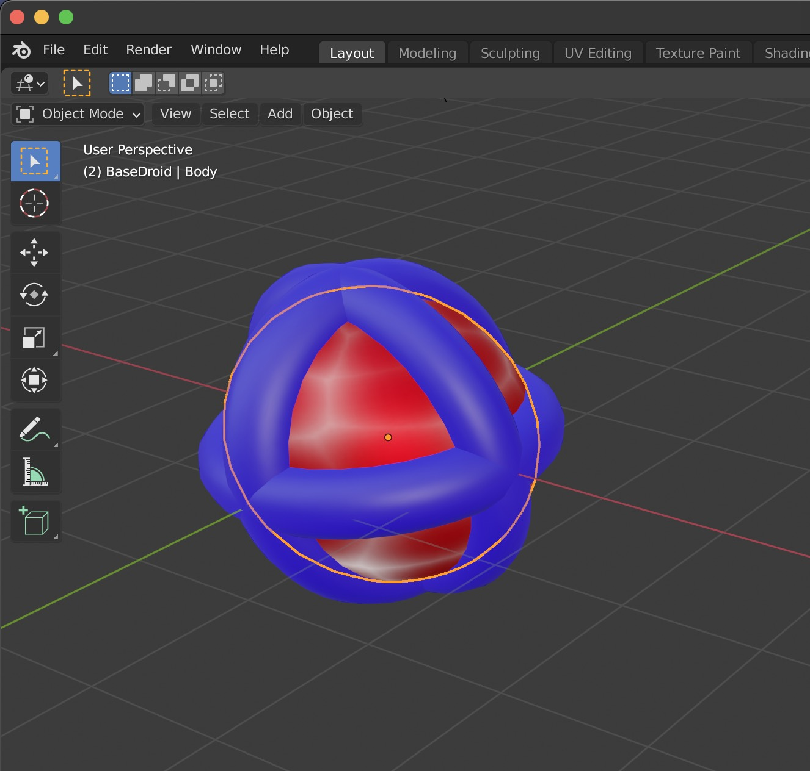

= Blender to SceneKit

This is a short notice how to import https://www.blender.org[Blender] scenes into https://developer.apple.com/scenekit/[SceneKit].

== The problem

When creating scenes with Blender it's possible to make haveay usage of textures.
These texturees must be imported within the scenes into SceneKit.

For example, the following object should be imported in SceneKit.
The inner red spehere contains a simple texture to change the material emission.

To interact with external tools Blender offers various formats to export.
The default format is the vendor independent Collada format (extension: `dae`).

The main problem: Blender doesn't export the textures of the scene into Collada files.
Also other formats like Wavefronts OBJ format contains a reference to the texture image in the MTL file.
But this reference is relative to the Blender file. 
The texture file must be manually imported into SceneKit addditional to the `dae` file.
That's a very error-prone process.

== A possible solution

The `glTF 2.0` format contains textures after exporting from Blender.
Nevertheless, SceneKit can't handle the `glTF` format out of the box.

At WWDC 2019 presented https://developer.apple.com/videos/play/wwdc2019/602/[a tool to support USD], a https://en.wikipedia.org/wiki/Universal_Scene_Description[scene format created by Pixar].
SceneKit supports this format out of the box.

The presented tool supports the conversion of different scene formats into the USDZ format. 
One of these formats is `glTF 2.0`.

=== Install the tool in my environment

First I must downnload the USDZ tool from Apple.
It is located at the https://developer.apple.com/augmented-reality/tools/[AR Creation Tools].
After clicking _Download USDZ tools_ you must login with your Apple developer credentials.
Downloading is straight forward.
I downloaded version 0.64 which comes as a `dmg` file.
Install the tools by double click the file and follow the installation instructions.

==== Add to PATH

I also added the tools to my `PATH` environment variable in the `~/.profile` file.
This looks like the following:

[source,sh]
----
USDPATH="/Applications/usdpython/USD"
export PATH="/Applications/Xcode.app/Contents/Developer/usr/bin:${PATH}"
export PATH="${USDPATH}:${PATH}"
export PATH="/Applications/usdpython/usdzconvert:${PATH}"
export PYTHONPATH=$PYTHONPATH:${USDPATH}/lib/python
----

The information is taken from the `USD.command` file at `/Applications/usdpython/USD`.

Now I can use the `usdzconvert` commandline tool from all my terminals.

=== Export `glTF` and convert to `USDZ`

After installation of `usdzconvert` I exported the scene of the first image as `glTF 2.0` file.
To do this just follow the instruction of the export dialog. It's also for a newbie like my straight forward.

The name of my `glTF` file is now `BaseDroid2.gltf`
It can be converted into a `USDZ` file with the following command line:

[source,sh]
----
usdzconvert -copytextures BaseDroid2.gltf
----

If all went well, a file `BaseDroid2.gltf` was created in the folder where the `glTF` lays.

The output of the tools may look like the following:

----
Sascha:~ saschakohlmann$ usdzconvert -copytextures BaseDroid2.gltf
Input file: BaseDroid2.gltf
Output file: BaseDroid2.usdz
usdARKitChecker: [Pass] BaseDroid2.usdz
Sascha:~ saschakohlmann$
----

That's it.

=== Import into a Scene of SceneKit

Via drag and drop import the `BaseDroid2.usdz` file into your SceneKit project.
You don't need to convert it into the `scn` format again.
Nevertheless, that's also possible with `Èditor → Convert to SceneKit file format (.scn)` in Xcode.

If you select the `BaseDroid2.usdz` file in Xcode you'll see the following:

When importing a Blender exported `dae` file only it looks like this:

