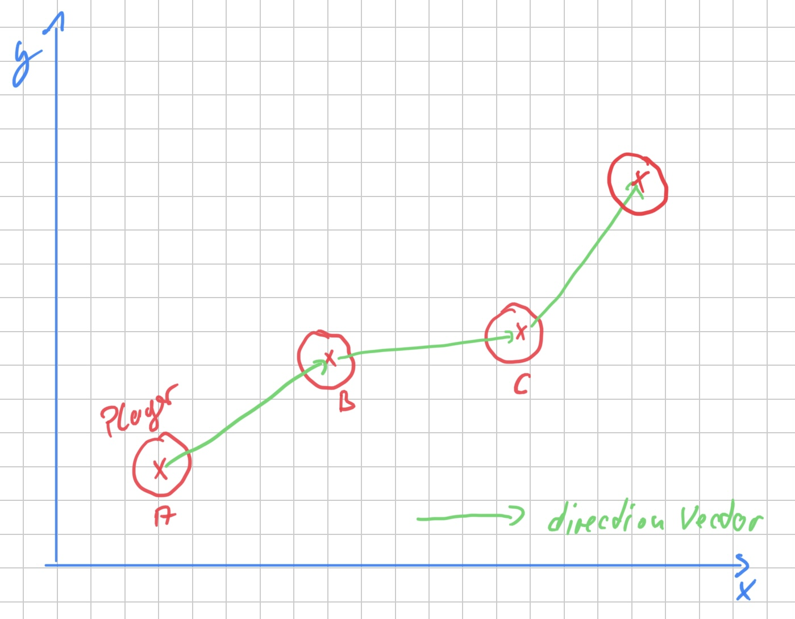
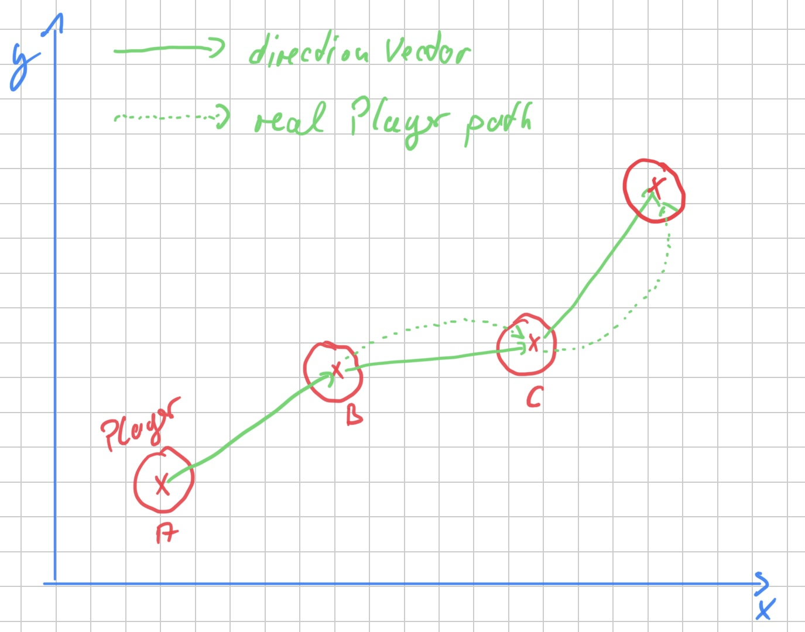

= Euclidian vs. Newton game steering

After finishing the joystick, I started with moviing the player droid around on the playfield.

== anchor:euclidian-movement[] Simple XY (euclidian) movement

The first implementation was a simple moving in X and Y coordinates (from a direction vector) and the velocity.
The implementation based on a `SCNAction` created with the `moveBy` method enclosed by a `repeatForever` action.

=== anchor:too-much-events[] Too much events cause a poor movement pattern

In my naive approch a reseted this action with every change event (`onTouchesMoved`) by the joystick. 
This resulted in a very modest movement pattern.
The events came way too fast and the movement became slower and slower when the user changed direction.

I solved this problem by requiring at least 33 milliseconds to elapse between two changes.

I once learned - I don't know if this is correct - that 33 milliseconds is approximately the rate at which our consciousness processes information.
Not really fast, but massively parallel :-)

== Newton based steering through physics engine

After the XY based implementation, I thought that a physic engine based implementation would allow more natural movements.
This means that the player character's movement is also affected by things like mass, friction, and damping.

Example: the player accelerates his character by moving the joystick.
Then he changes the direction.
Based on his current speed and damping, the direction change is delayed and the character slides across the playing field.  

With a <<euclidian-movement, Simple XY (euclidian) movement>>, the motion path looks something like this:

The green direction vectors show the path of the players character.

Depending on the speed, mass and damping of the player character, the real path (dotted line) will look slightly different from the path defined by the player:

Intuitively, this is, in my opinion, the more elegant approach to simulate natural movements.
However, there are several problems at once.

== Problems with physics engine controlled steering

The joystick provides a normalized direction vector and a velocity between 0 and 1.
The speed is mapped to a value between minimum speed and maximum speed min game.
For example, to a value between 0.3 and 4.
The values are chosen arbitrarily for now.

The direction vector is multiplied by the mapped velocity and thus the https://developer.apple.com/documentation/scenekit/scnphysicsbody/1514801-applyforce[`applyForce`] method of the https://developer.apple.com/documentation/scenekit/scnphysicsbody[`SCNPhysicsBody`] is called.

The problems:

1. based on the basic configuration of `SCNPhysicsBody`, the player character takes a very long time to come to a stop when the joystick reports a stop move.
2. changing the direction with the common `SCNPhysicsBody` configuration results in heavy slidings.
3. the damping doesn't allow a continous movement if the joystick is still in the movement phase.
  After a while the players character stops.
4. the position coordinates of the player character are not updated.

=== Solving the problems 1. and 2.

Solving the problems 1. and 2. is easy. With a higher _damping_ value of `SCNPhysicsBody` stoping and sliding can be rduced.
Neverthless, in this case the maximum mapped velocity must be increased.

In the example I use a damping of 0.5 (default: 0.1) and a velocity mapping between 2 and 7.

=== Solving the problem 3.

This problem is a little more difficult to solve.
But the question is: why does it need to be solved at all?

The reason to solve the problem is the player experience.
While the player controls his character with the joystick, he easily recognizes that he must permanently move the virtual joystick on the touch device in the direction in which his character should move in order not to lose velocity.
This is not intuitive.
In such a behavior, the player has to interrupt the movement in between, for example, to reposition his finger on the touch device to contiue the mevement.
Touch devices are not as big as the virtual game world can be.

As a solution, I implemented a mechanism similar the <<too-much-events, "Too much events cause a poor movement pattern">> solution.
If no new interaction was sent from the joystick within an interval of 33 milliseconds, `applyForce` is called again with the original direction vector.
This mechanis is implemented in the method https://developer.apple.com/documentation/scenekit/scnscenerendererdelegate/1523483-renderer[`func renderer(_:willRenderScene, atTime)`] of https://developer.apple.com/documentation/scenekit/scnscenerendererdelegate[`SCNSceneRendererDelegate`].

=== Solving the problem 4.

In case the physics engine took over the controll/steering of the characters, the position vectors are not updated.
However, https://developer.apple.com/scenekit/[_SceneKit_] uses the coordinates from `SCNNode.presentation.position` in the background.
And these position values are also updated.
That's it.

== Next step

Next I will try to combine the physics engine control with https://developer.apple.com/documentation/gameplaykit[_GameplayKit_].

Stay tuned.

